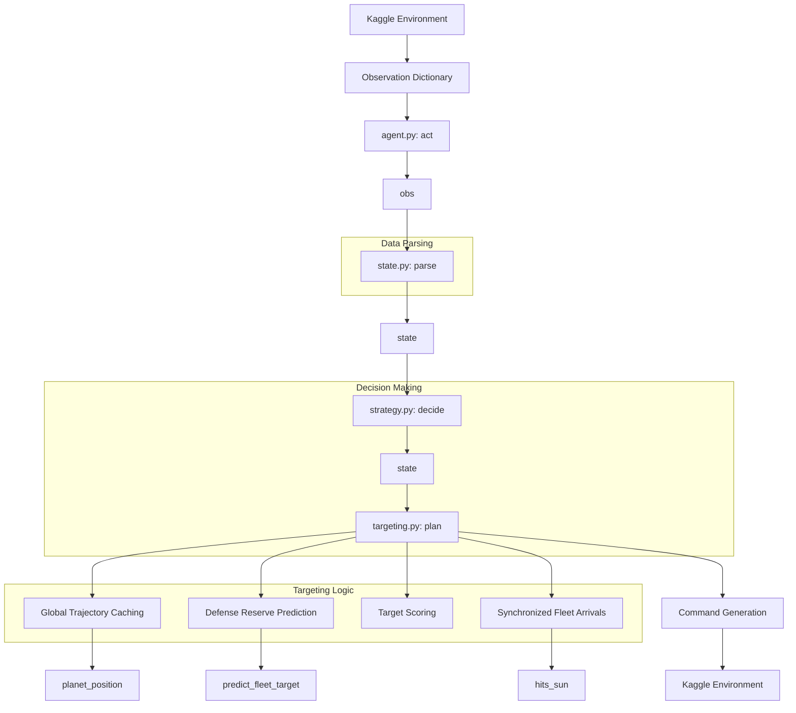
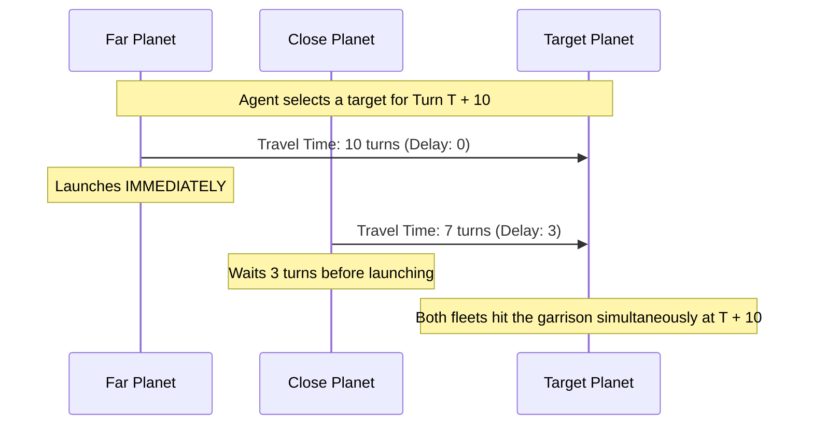

# Orbit Wars Agent

This directory contains the Kaggle agent source code. The agent runs as a single Python entry point (`agent.py:act`), parses the environment observation, and computes optimal launch commands.

## Architecture Overview

The core loop relies on separating state parsing from decision logic, while heavily utilizing a precomputed physics engine to stay within real-time turn limits.

## Synchronized Fleet Arrivals (v1 Logic)

To prevent enemy defensive reserves from picking off our attacking fleets one-by-one, the targeting logic utilizes a synchronized arrival strategy. It targets a planet at a specific future time (`delta_t`) and coordinates launches across multiple owned planets so they land exactly on the same turn.

## Module Responsibilities

- **`agent.py`**: The interface for the Kaggle environment. Wires the parser to the strategy.
- **`state.py`**: Typed data structures (`State`, `Planet`, `Fleet`, `Comet`) and observation parsing.
- **`strategy.py`**: Per-turn policy interface. Currently acts as a pass-through to `targeting.py`.
- **`targeting.py`**: The core AI logic (ROI targeting, defensive reserves, and synchronized launch delays).
- **`physics.py`**: Exact extraction of the Kaggle environment's continuous math, used for predictive raycasting, line-of-sight checks, and trajectory generation.
