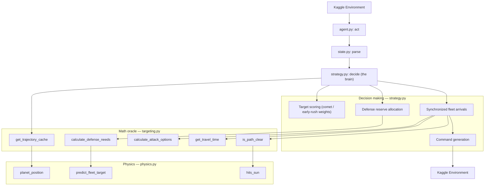
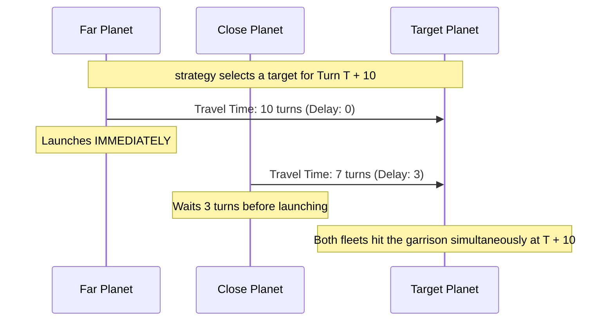

# Orbit Wars Agent — v1_1 (active development)

> **Active development copy.** Macro changes happen here. The frozen baseline is
> [`../v1/`](../v1/); the two behave identically until this copy diverges.

This directory is the Kaggle agent. It runs as a single Python entry point
(`agent.py:act`), parses the environment observation, and computes launch
commands, leaning on a precomputed physics oracle to stay inside real-time turn
limits.

## Architecture (v1_1 refactor)

v1_1 splits the old monolithic `targeting.py` in two: **`strategy.py` is the
brain** (every decision), and **`targeting.py` is a pure-math oracle** (every
calculation, no decisions). This is the difference from the v1 baseline, where
`targeting.py` held both.

## Synchronized Fleet Arrivals

To stop enemy reserves from picking off attackers one-by-one, `strategy.decide`
targets a planet at a chosen future turn (`delta_t`) and staggers launches across
owned planets so every fleet lands on the same turn. The travel-time and
attack-window math come from `targeting.py`.

## Module Responsibilities

- **`agent.py`**: The Kaggle interface. Wires the parser to the strategy
  (`act → parse → decide`). One line of logic.
- **`state.py`**: Typed data structures (`State`, `Planet`, `Fleet`, `Comet`)
  and observation parsing. `parse` is the only integration seam with the env.
- **`strategy.py`**: The brain. Owns target scoring, defense-reserve allocation,
  synchronized launch delays, and command generation. Calls `targeting.py` for
  every number it needs.
- **`targeting.py`**: Pure-math oracle. `get_trajectory_cache` (per-game
  trajectory precompute), `calculate_defense_needs` (incoming enemy fleets),
  `calculate_attack_options` (ships + position to capture a target at `delta_t`),
  `get_travel_time`, `is_path_clear`. Makes no strategic decisions.
- **`physics.py`**: Exact extraction of the Kaggle environment's continuous math
  — orbital positions, fleet-target prediction, sun line-of-sight. The frozen
  oracle, pinned to [`../addons/quant/baselines.json`](../addons/quant/baselines.json).
