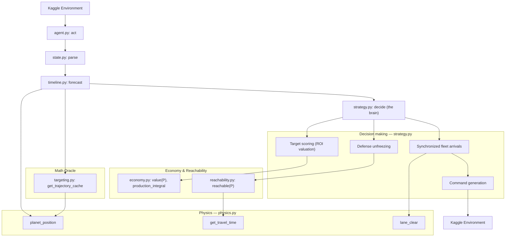
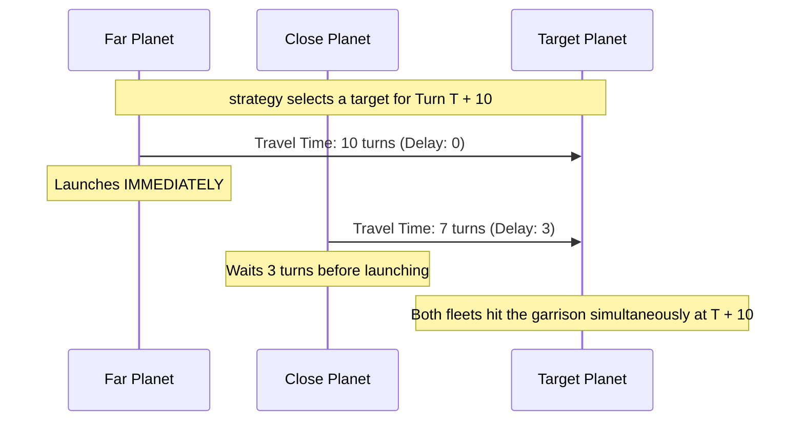

# Orbit Wars Agent — v2_macro

> **Active development copy.** Macro changes happen here. The frozen baseline is
> [`../v1/`](../v1/); the two diverge here via the v2 Information Model.

This directory is the Kaggle agent. It runs as a single Python entry point
(`agent.py:act`), parses the environment observation, and computes launch
commands, leaning on a precomputed physics oracle to stay inside real-time turn
limits.

## Architecture (v2 Information Model)

v2_macro implements the v2 Information Model. Instead of a monolithic `targeting.py`, it separates forecasting (`timeline.py`), strategic valuation (`economy.py`), and reachability races (`reachability.py`).

## Synchronized Fleet Arrivals

To stop enemy reserves from picking off attackers one-by-one, `strategy.decide`
targets a planet at a chosen future turn (`delta_t`) and staggers launches across
owned planets so every fleet lands on the same turn. The travel-time and
attack-window math come from `reachability.py` and `physics.py`.

## Module Responsibilities

- **`agent.py`**: The Kaggle interface. Wires the parser to the strategy
  (`act → parse → decide`). One line of logic.
- **`state.py`**: Typed data structures (`State`, `Planet`, `Fleet`, `Comet`)
  and observation parsing. `parse` is the only integration seam with the env.
- **`timeline.py`**: Forecasts future state by folding arriving fleets chronologically. Provides `garrison_at(T)` and `owner_at(T)`.
- **`economy.py`**: Calculates target ROI (`value(P)`) and tracks the production-integral metric.
- **`reachability.py`**: Calculates the fastest credible arrival times (`reachable(P)`) to define defense thresholds and strike windows.
- **`strategy.py`**: The brain. Owns target scoring, defense-reserve allocation,
  synchronized launch delays, and command generation.
- **`targeting.py`**: Legacy pure-math oracle. Primarily provides `get_trajectory_cache`.
- **`physics.py`**: Exact extraction of the Kaggle environment's continuous math
  — orbital positions, fleet-target prediction, sun line-of-sight, and travel times.
